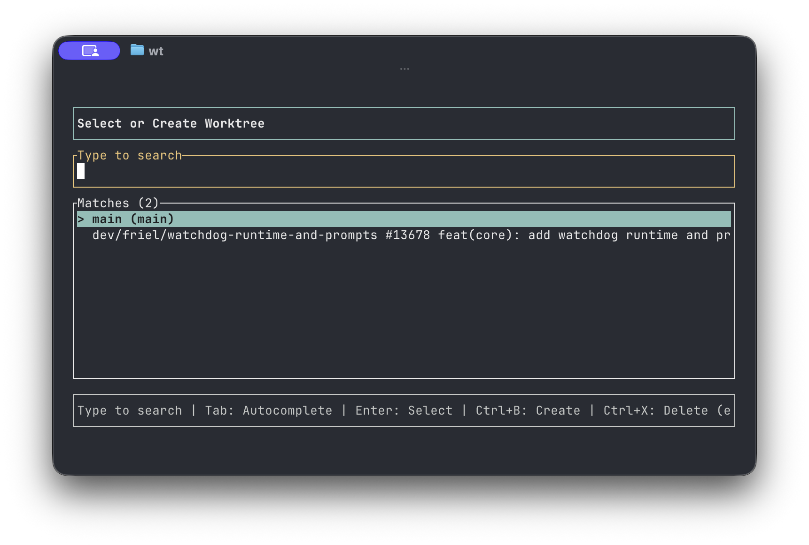

# wt-manager

Git worktree 관리 도구 - TUI 기반 워크트리 생성/전환/삭제


## 요구사항

- **zsh/bash**: `wt init` shell integration 사용
- **cargo**: Rust 빌드 도구

## 설치

```bash
# 권장: git URL에서 바로 설치
cargo install --git https://github.com/boxqkrtm/wt-manager.git
wt init
source ~/.zshrc
```

대안:

```bash
git clone https://github.com/boxqkrtm/wt-manager.git
cd wt-manager
cargo install --path .
wt init
source ~/.zshrc
```

`wt init`은:
- `~/.wt-manager.sh`를 생성/갱신
- `~/.zshrc`에 `source ~/.wt-manager.sh` 추가
- `~/.bashrc`가 있으면 여기도 동일하게 추가
- zsh/bash에서 `wt <Tab>`, `wt cd <Tab>`, `wt run <Tab>`, `wt delete <Tab>` 기존 로컬 브랜치 자동완성 등록

> `~/.wt-manager.sh`는 generated file이며, `wt init` 재실행 시 갱신될 수 있습니다.

## 사용법

### 기본 사용

```bash
# TUI로 워크트리 검색/생성
wt

# TUI로 강제 진입
wt tui

# shell integration 설치
wt init

# 특정 브랜치 워크트리 생성/이동
wt feature-branch

# 명령형
wt list
wt cd feature-branch
wt run feature-branch -- pnpm test
wt delete feature-branch
wt delete feature-branch --force
wt clean
wt clean --merged
wt clean --remote origin --dry-run

# 저장된 프로젝트 목록
wt project list

# 저장소별 wt 설정
wt config show
wt config copy add .env.local
wt config copy remove .env.local
wt config hook add post-create "pnpm install"
wt config hook remove post-create 0
```

### `wt worktree clean` 도움말

- 용도: 리모트에서 삭제된 추적 브랜치 기준으로 워크트리를 정리합니다.
- 동작:
  - 기본적으로 각 워크트리의 추적 브랜치(`branch@{upstream}`)가 존재하지 않으면 삭제 대상
  - 실행 전 `git fetch --prune <remote>`로 원격 상태를 갱신(전체는 `--skip-fetch`로 생략 가능)
  - 기본은 현재 설정된 모든 추적 upstream 기준, 특정 원격만 지정하려면 `--remote origin`
  - 삭제 전 미리 확인하려면 `--dry-run`
  - 강제 삭제가 필요하면 `--force`
  - 추적 브랜치가 없는 워크트리까지 포함하려면 `--include-untracked`

### `wt worktree clean --merged`

- 용도: 기본 브랜치에 이미 merge된 worktree 브랜치를 정리합니다.
- 기준 브랜치:
  - `--base <branch>` 지정 시 해당 브랜치
  - 미지정 시 `origin/HEAD` 기준 default branch를 우선 사용
  - 실패 시 `origin/main`, `origin/master`, `main`, `master` 순서 fallback
- `--dry-run`, `--force`는 기존 clean과 동일하게 동작합니다.

### `wt config`

- 설정은 repo-local 파일이 아니라 내장 `~/.wt-manager/db.json`에 repo별로 저장됩니다.
- 지원 항목:
  - `copy_files`: 새 worktree 생성 시 복사할 상대 경로 목록
  - `postCreate` hooks: 새 worktree 생성 직후 실행
  - `postCd` hooks: worktree 진입 직전 실행
- 기본값:
  - 새 repo entry 생성 시 lockfile / env manager 파일을 기준으로 `postCreate` 기본 hook이 자동 seed 됩니다.
  - 기존 repo entry는 자동으로 변경되지 않습니다.
- copy 규칙:
  - repo root 기준 상대 경로만 지원
  - `..`가 포함된 상위 디렉터리 경로는 허용하지 않음
  - source가 없으면 skip
  - destination이 이미 있으면 overwrite하지 않음
- hook은 `zsh -c`로 실행되며, 필요한 경우 shell rc를 먼저 source한 뒤 실행합니다.
- 런타임에서는 파일 탐지 기반 자동 설치를 하지 않고, DB에 저장된 hook만 실행합니다.

### `--help`에서 확인할 수 있는 항목

- `wt --help`에 기본 동작(`wt`, `wt <branch>`), TUI 진입(`wt tui`), 워크트리/프로젝트 명령이 노출됩니다.
- `wt worktree switch`와 `wt <branch>`는 동작이 같습니다.
- 삭제는 기본적으로 안전 삭제입니다. 메인 워크트리는 삭제할 수 없고, 실패 시 메시지에 `--force` 재시도 권장안이 표시됩니다.
- 실제로 셸의 작업 디렉터리가 이동되는 것은 `wt init`이 생성하는 `~/.wt-manager.sh`의 `cd` 파싱 동작입니다.

### TUI 조작법

#### 프로젝트 선택 화면
- **타이핑**: Fuzzy 검색
- **Left / Right / Home / End**: 입력 커서 이동
- **Backspace / Delete**: 커서 기준 삭제
- **Up / Down**: 후보 선택
- **Tab**: 최상위 매치로 자동완성
- **Enter**: 선택한 프로젝트로 이동
- **Ctrl+C / Esc**: 취소

#### 워크트리 선택 화면
- **타이핑**: Fuzzy 검색
- **Left / Right / Home / End**: 입력 커서 이동
- **Backspace / Delete**: 커서 기준 삭제
- **Up / Down**: 후보 선택
- **Tab**: 현재 선택 후보로 자동완성
- **Enter**: 현재 선택된 워크트리 선택
- **Ctrl+B**: 새 브랜치/워크트리 생성
- **Ctrl+X**: 워크트리 삭제 (정확히 일치할 때만 활성화)
- **Ctrl+C / Esc**: 취소

### 주요 기능

#### 1. 스마트 워크트리 생성
- 기존 브랜치로 먼저 시도
- 브랜치가 없으면 자동으로 새 브랜치 생성

#### 2. 안전한 삭제
- **정확한 일치**: 입력값이 100% 일치할 때만 삭제 가능
- **메인 보호**: 메인 워크트리는 삭제 불가
- **변경사항 보호**: 커밋되지 않은 파일이 있으면 삭제 차단

#### 3. 프로젝트 관리
- 워크트리 안에서 실행 시 메인 저장소 자동 인식
- 최근 사용 프로젝트 우선 표시

#### 4. GitHub PR 표시 제한
- `gh` CLI가 설치되어 있으면 워크트리 목록에 열린 PR 번호/제목을 함께 표시합니다.
- PR 메타데이터 표시는 최대 100개의 open PR까지만 지원합니다.

### 동작 방식

1. 새 워크트리는 기본적으로 `~/_wt/{owner}-{repo}-{hash5}/{브랜치}/`에 생성
2. 기존 버전에서 이미 사용 중인 `~/_wt/{프로젝트명}_{해시}/` 경로가 있으면 그 경로를 계속 재사용
   이 fallback은 구버전 호환 유지를 위한 동작이며, 충분한 마이그레이션 이후 제거될 수 있습니다.
3. 새 repo entry가 처음 생성될 때 lockfile / env manager 파일 기준으로 기본 `postCreate` hook 값이 seed 될 수 있음
4. worktree 생성/이동 시에는 파일 자동 탐지 없이 `~/.wt-manager/db.json`에 저장된 `postCreate` / `postCd` hook만 실행
5. 실제 셸 이동은 `wt init`이 생성한 `~/.wt-manager.sh`가 `cd` 출력을 파싱해서 수행

## 라이선스

MIT
